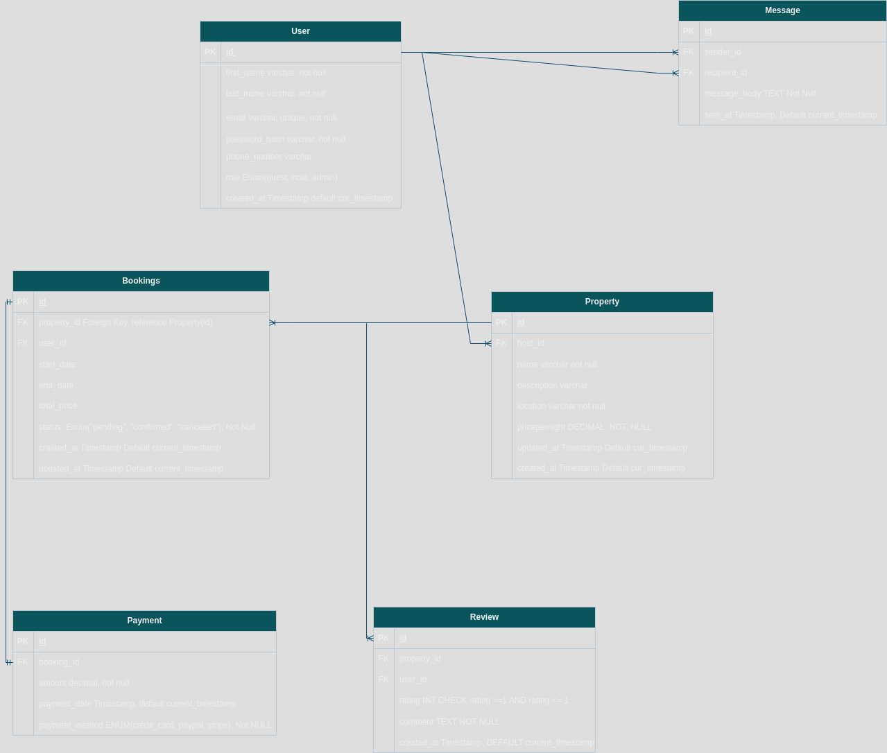

# Normalization of ERD

The database design is already in 3NF (Third Normal Form). But in other to ensure BCNF
the table bookings will have a unique constraint on the combination of property_id, start_date, end_date
